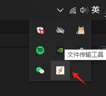
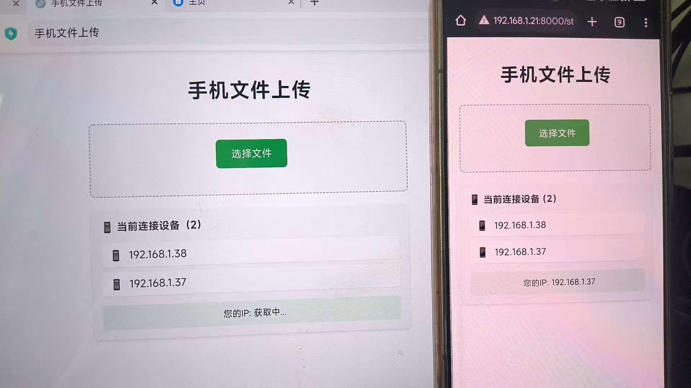
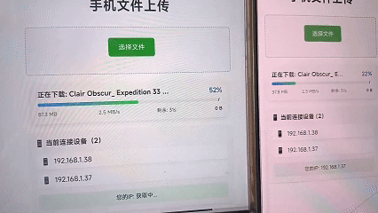

# QTransfer

一个在内网环境中为了能够让用户在电脑与手机之间方便互相传输的应用（比如我不想登录微信传输、其他通讯软件、USB数据线传输等），只需保证设备之间在同一网络即可，能够在电脑与手机之间互相传输文件，方便快捷，所以诞生了这个小工具，足以满足小需求。

小工具图标，启动后就会出现设备连接管理器弹框，关闭后会通过系统托盘的方式运行，右键菜单即可再次弹出管理器

设备连接器可以看见连接的设备IP（内外IP），你可以通过发送文件按钮向连接的手机发送电脑设备上的文件实现双向互传

在手机设备中你可以看见其他IP展示、连接数，只需点击“选择文件”按钮，然后选择你手机上需要上传的文件后，将会自动上传到电脑（当前目录/路径下会生成一个uploads文件夹，在手机上上传的文件都在保存在uploads文件夹）

在电脑中将文件发送给连接的设备时，会展示进度条观看，并支持多设备同时发送

